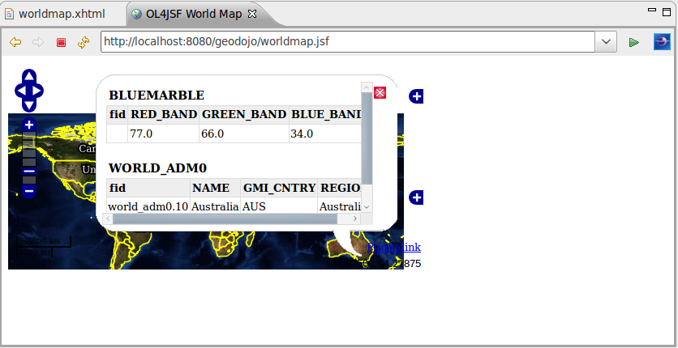

:Author: Rafael Soto
:Author: Robert Anderson
:Version: |release|
:License: Create Commons with attribution

********************************************************************
Disponibilizando os mapas de forma rica na web - OpenLayers & Ol4JSF
********************************************************************

.. contents::

Nesse capítulo vamos entender qual a relação existente entre o OpenLayers e o OL4JSF. Aprenderemos como instalar, configurar e utilizar os recursos disponíveis no OL4JSF em nossas aplicações JEE.

###################
OpenLayers & OL4JSF
###################

O OpenLayers é uma biblioteca javascript, opensource, que possui uma grande variedade de recursos para plotagem de mapas nos principais navegadores do mercado. Se ela é tão boa assim, então qual o problema?

Um dos grandes problemas não é a API em si, mas o javascript. Por ser uma linguagem dinâmica, as IDEs não conseguem ajudar muito e os desenvolvedores acabam sempre tendo que recorrer para a documentação para fazer as mínimas coisas. Em qual pacote está a classe responsável por exibir o mapa? Quais são parâmetros para instanciação? Enfim, cabe ao desenvolvedor conhecer cada detalhe da API através da documentação.

É nesse cenário que entra o OL4JSF. Ele encapsula boa parte da lógica responsável pela instanciação dos objetos OpenLayers e ainda, pelo fato de ser um conjunto de componentes JSF, integra-se perfeitamente aos ambientes de desenvolvimento JEE atuais: auto completar, ajuda contextual, janela de propriedades, palheta de componentes, etc.

Mas agora vem a melhor parte. O OL4JSF já foi concebido para facilitar o desenvolvimento, porém sem "engessá-lo". Como assim? Desenvolvedores experientes com OpenLayers na maioria das vezes vão querer ter a possibilidade de acessar os recursos da API diretamente. Além disso, nem todas as funcionalidades existentes no OpenLayers estarão disponíveis no OL4JSF, ou pelo menos, poderão levar um certo tempo para serem implementadas. Sendo assim, os componentes OL4JSF podem ser disponibilizados para o contexto javascript na forma de variáveis globais e serem acessados normalmente em qualquer código javascript da página. Adicionalmente, o OL4JSF já disponibiliza um componente *<m:script />* que possibilita a inserção de código javascript diretamente na elaboração do mapa. Então, que tal visualizarmos isso e muito mais na prática?

####################
Instalação do OL4JSF
####################

Vamos instalar o OL4JSF via Maven. Para isso basta colocar a seguintes entradas no pom.xml:

.. code-block:: xml

	<repositories>
	<!-- Outros repositórios omitidos -->
	<repository>
		<id>java.net2</id>
		<name>Repository hosting the jee6 artifacts</name>
		<url>http://download.java.net/maven/2</url>
	</repository>
	</repositories>
	<dependencies>
		<!-- Outras dependencias omitidas -->
	        <dependency>
	            <groupId>org.ol4jsf</groupId>
	            <artifactId>ol4jsf-core</artifactId>
	            <version>2.0-SNAPSHOT</version>
	            <scope>compile</scope>
	        </dependency>
	</dependencies>

Nesse altura do campeonato, o nosso pom deve estar assim:

.. code-block:: xml
	:linenos:

	<project xmlns="http://maven.apache.org/POM/4.0.0" xmlns:xsi="http://www.w3.org/2001/XMLSchema-instance"
	  xsi:schemaLocation="http://maven.apache.org/POM/4.0.0 http://maven.apache.org/xsd/maven-4.0.0.xsd">
	    <modelVersion>4.0.0</modelVersion>
	
	    <groupId>org.latinoware.geodojo</groupId>
	    <artifactId>geodojo</artifactId>
	    <version>1.0-SNAPSHOT</version>
	    <name>Geodojo Project</name>
	    <packaging>war</packaging>
	
	    <repositories>
	        <repository>
	            <id>java.net2</id>
	            <name>Repository hosting the jee6 artifacts</name>
	            <url>http://download.java.net/maven/2</url>
	        </repository>
	        <repository>
	            <id>EclipseLink Repo</id>
	            <url>http://www.eclipse.org/downloads/download.php?r=1&amp;nf=1&amp;file=/rt/eclipselink/maven.repo</url>
	        </repository>
	        <repository>
	            <id>OSGEO GeoTools repo</id>
	            <url>http://download.osgeo.org/webdav/geotools</url>
	        </repository>
	        <repository>
	            <id>Hibernate Spatial repo</id>
	            <url>http://www.hibernatespatial.org/repository</url>
	        </repository>
	        <!-- add JBOSS repository for easy access to Hibernate libraries -->
	        <repository>
	            <id>JBOSS</id>
	            <url>http://repository.jboss.com/maven2</url>
	        </repository>
			      
	    </repositories>
	
	    <properties>
	        <project.build.sourceEncoding>UTF-8</project.build.sourceEncoding>
	    </properties>
	
	    <build>
	        <plugins>
	            <plugin>
	                <groupId>org.apache.maven.plugins</groupId>
	                <artifactId>maven-compiler-plugin</artifactId>
	                <configuration>
	                    <source>1.6</source>
	                    <target>1.6</target>
	                </configuration>
	            </plugin>
	        </plugins>
	    </build>
	
	    <dependencies>
	        <dependency>
	            <groupId>javax.servlet</groupId>
	            <artifactId>jstl</artifactId>
	            <version>1.2</version>
	        </dependency>
	        <dependency>
	            <groupId>javax.servlet</groupId>
	            <artifactId>servlet-api</artifactId>
	            <version>2.5</version>
	        </dependency>
	        <dependency>
	            <groupId>hsqldb</groupId>
	            <artifactId>hsqldb</artifactId>
	            <version>1.8.0.10</version>
	            <scope>compile</scope>
	        </dependency>
	        <dependency>
	            <groupId>javax.enterprise</groupId>
	            <artifactId>cdi-api</artifactId>
	            <version>1.0-SP1</version>
	            <scope>compile</scope>
	        </dependency>
	        <dependency>
	            <groupId>org.jboss.weld</groupId>
	            <artifactId>weld-api</artifactId>
	            <version>1.0-SP1</version>
	            <scope>runtime</scope>
	        </dependency>
	        <dependency>
	            <groupId>org.jboss.weld.servlet</groupId>
	            <artifactId>weld-servlet</artifactId>
	            <version>1.0.1-Final</version>
	            <scope>runtime</scope>
	        </dependency>
	        <dependency>
	            <groupId>com.sun.faces</groupId>
	            <artifactId>jsf-api</artifactId>
	            <version>2.0.3</version>
	            <scope>compile</scope>
	        </dependency>
	        <dependency>
	            <groupId>com.sun.faces</groupId>
	            <artifactId>jsf-impl</artifactId>
	            <version>2.0.3</version>
	            <scope>runtime</scope>
	        </dependency>
	        <dependency>
	            <groupId>hibernate</groupId>
	            <artifactId>hibernate-entitymanager</artifactId>
	            <version>3.4.0.GA</version>
	        </dependency>	        	        
	        
	        <!-- the Postgis JDBC driver -->
	        <dependency>
	            <groupId>org.postgis</groupId>
	            <artifactId>postgis-jdbc</artifactId>
	            <version>1.3.3</version>
	        </dependency>
	
	        <!-- the postgresql driver -->
	        <dependency>
	            <groupId>postgresql</groupId>
	            <artifactId>postgresql</artifactId>
	            <!-- scope>provided</scope>  -->
	            <version>8.4-701.jdbc3</version>
	        </dependency>
	
	        <!-- Hibernate uses slf4j for logging, for our purposes here use the simple backend -->
	        <dependency>
	            <groupId>org.slf4j</groupId>
	            <artifactId>slf4j-simple</artifactId>
	            <version>1.5.6</version>
	        </dependency>
	               
	        <dependency>
	            <groupId>org.slf4j</groupId>
	            <artifactId>slf4j-api</artifactId>
	            <version>1.5.6</version>
	        </dependency>	        
	       
	        <!-- GIS DEPENDENCIES -->
	        <dependency>
	            <groupId>org.ol4jsf</groupId>
	            <artifactId>ol4jsf-core</artifactId>
	            <version>2.0-SNAPSHOT</version>
	            <scope>compile</scope>
	        </dependency>
	        <dependency>
	            <groupId>org.hibernatespatial</groupId>
	            <artifactId>hibernate-spatial-postgis</artifactId>
	            <version>1.0</version>
	        </dependency>	
	    </dependencies>		
	</project>

############################
Exibindo nosso primeiro mapa
############################

Vamos criar uma página para exibir a layer 'world' adicionada ao geoserver no capítulo anterior.

1. Clique com o botão direito sobre o diretório *geodojo/src/main/webapps* e escolha a opção *HTML File*. A seguinte tela deverá aparecer:

.. image:: images/ol4jsf_1.png
	:scale: 60

2. Digite o nome *worldmap.xhtml* e, em seguida, clique em next.

.. image:: images/ol4jsf_2.png
	:scale: 60

3. Selecione a opção *New XHTML File (1.0 transitional)* e finish.

4. Substitua o código gerado pelo abaixo:

.. code-block:: xml
	:linenos:

	<?xml version="1.0" encoding="UTF-8" ?>
	<!DOCTYPE html PUBLIC "-//W3C//DTD XHTML 1.0 Transitional//EN" "http://www.w3.org/TR/xhtml1/DTD/xhtml1-transitional.dtd">
	<html xmlns="http://www.w3.org/1999/xhtml"
		  xmlns:h="http://java.sun.com/jsf/html"
	      xmlns:f="http://java.sun.com/jsf/core"
	      xmlns:ui="http://java.sun.com/jsf/facelets"
			xmlns:m="http://www.ol4jsf.org">
	<h:head>
		<meta http-equiv="Content-Type" content="text/html; charset=UTF-8" />
		<title>OL4JSF World Map</title>
	</h:head>
	<h:body>
		<m:map width="512px" height="256px">
			<m:wmsLayer name="World Layer" url="http://localhost:8082/geoserver/wms" params="{layers:'world'}" />
		</m:map>
	</h:body>
	</html>

5. Execute o projeto e veja o resultado.

Muito simples, não? :)

Acabamos de exibir um mapa contendo uma única camada vinda do GeoServer. Que tal adicionarmos mais controles ao mapa?

Adicionando controles
=====================

No OL4JSF existem dois grandes grupos de componentes: <nome>Layer e <nome>Control. Os pertencentes ao primeiro grupo são componentes que representam camadas (wms, wfs, google, etc). Já o segundo grupo, são controles (zoom, layerSwitch, etc).

Vamos incrementar nosso mapa com alguns controles, alterando o xhtml anterior e deixando-o assim:

.. code-block:: xml
	:linenos:

	<?xml version="1.0" encoding="UTF-8" ?>
	<!DOCTYPE html PUBLIC "-//W3C//DTD XHTML 1.0 Transitional//EN" "http://www.w3.org/TR/xhtml1/DTD/xhtml1-transitional.dtd">
	<html xmlns="http://www.w3.org/1999/xhtml"
		xmlns:h="http://java.sun.com/jsf/html"
		xmlns:f="http://java.sun.com/jsf/core"
		xmlns:ui="http://java.sun.com/jsf/facelets"
		xmlns:m="http://www.ol4jsf.org">
	<h:head>
		<meta http-equiv="Content-Type" content="text/html; charset=UTF-8" />
		<title>OL4JSF World Map</title>
	</h:head>
	<h:body>
		<m:map width="512px" height="256px" options="{controls: [], numZoomLevels: 6}">
			<m:wmsLayer name="World Layer Bluemarble"
				url="http://localhost:8082/geoserver/wms" params="{layers:'topp:bluemarble'}" />
			<m:wmsLayer name="World Layer ADM"
				url="http://localhost:8082/geoserver/wms" params="{layers:'topp:world_adm0',transparent:true}" options="{isBaseLayer:false}"/>
			<m:navigationControl />
			<m:panZoomBarControl />
			<m:layerSwitcherControl options="{ascending:false}" />
			<m:scaleLineControl />
			<m:mousePositionControl />
			<m:overviewMapControl />
			<m:keyboardDefaultsControl />
			<m:permalinkControl />
		</m:map>
	</h:body>
	</html>

Observem que tanto no atributo *options* quanto no *params* utilizamos um hash javascript passando parâmetros adicionais ao nosso componente.

Aproveite para perceber o que cada componente faz no mapa! Não tenha medo de usá-los! ;)

Obtendo mais informações a partir do mapa
=========================================

Que tal ao clicarmos no nosso mapa exibirmos um balão como o da figura abaixo?

Você pode ficar tentado em fazer o código abaixo.

.. code-block:: xml
	:linenos:

	<?xml version="1.0" encoding="UTF-8" ?>
	<!DOCTYPE html PUBLIC "-//W3C//DTD XHTML 1.0 Transitional//EN" "http://www.w3.org/TR/xhtml1/DTD/xhtml1-transitional.dtd">
	<html xmlns="http://www.w3.org/1999/xhtml"
		xmlns:h="http://java.sun.com/jsf/html"
		xmlns:f="http://java.sun.com/jsf/core"
		xmlns:ui="http://java.sun.com/jsf/facelets"
		xmlns:m="http://www.ol4jsf.org">
	<h:head>
		<meta http-equiv="Content-Type" content="text/html; charset=UTF-8" />
		<title>OL4JSF World Map</title>
	</h:head>
	<h:body>
		<m:map width="512px" height="256px" options="{controls: [], numZoomLevels: 6}">
			<m:wmsLayer name="World Layer Bluemarble"
				url="http://localhost:8082/geoserver/wms" params="{layers:'topp:bluemarble'}" />
			<m:wmsLayer name="World Layer ADM"
				url="http://localhost:8082/geoserver/wms" params="{layers:'topp:world_adm0',transparent:true}" options="{isBaseLayer:false}"/>
			<m:featureInfoPopup url="http://localhost:8082/geoserver/wms" />
			<m:navigationControl />
			<m:panZoomBarControl />
			<m:layerSwitcherControl options="{ascending:false}" />
			<m:scaleLineControl />
			<m:mousePositionControl />
			<m:overviewMapControl />
			<m:keyboardDefaultsControl />
			<m:permalinkControl />
		</m:map>
	</h:body>
	</html>

Observem na linha 18 a utilização do componente *<m:featureInfoPopup />*. Extremamente simples. Entretanto, existe uma restrição no OpenLayers que não permite que obtenhamos informações de uma camada a partir de um servidor de mapas, no nosso caso o GeoServer, que não esteja no subdomínio da aplicação. 

Url de nossa aplicação::

	http://localhost:8080/geodojo

Url de nosso servidor de mapas::

	http://localhost:8082/geoserver

O mais chato é que não é retornado nenhum erro. Simplesmente não funciona!

OL4JSF Proxy
============

Para resolver essas e outras questões o OL4JSF vem com um servlet que funciona como um proxy entre a sua aplicação e o servidor de mapas. Para instalá-lo basta adicionar a seguinte entrada ao seu web.xml:

.. code-block:: xml
	
    <servlet>
        <servlet-name>OL4JSFProxy</servlet-name>
        <servlet-class>org.ol4jsf.proxy.servlet.OL4JSFProxy</servlet-class>
    </servlet>

    <servlet-mapping>
        <servlet-name>OL4JSFProxy</servlet-name>
        <url-pattern>/OL4JSFProxy/*</url-pattern>
    </servlet-mapping>

O OL4JSF esperar um arquivo com nome ol4jsf-proxy.xml no seu classpath. É nele onde faremos a configuração do proxy.

1. Clique com o botão direito em *geodojo/src/resources -> New -> Other... -> XML -> XML File*.

.. image:: images/ol4jsf_6.png
	:scale: 60

2. Clique em próximo e coloque no nome *ol4jsf-proxy.xml*.

3. Coloque o seguinte conteúdo no arquivo:

.. code-block:: xml
	:linenos:

	<?xml version="1.0" encoding="UTF-8"?>
	<ol4jsf-proxy>
		<use-environment id="desenv" />
		<environment id="desenv">
			<description>Development Environment.</description>
			<resources>
				<resource name="wfs">
					<url>http://localhost:8082/geoserver/wfs</url>
				</resource>
				<resource name="wms">
					<url>http://localhost:8082/geoserver/wms</url>
				</resource>
			</resources>
		</environment>
	</ol4jsf-proxy>

Nesse arquivo podemos configurar vários ambientes (*environment*), porém apenas um pode estar ativo (*use-environment*). É dentro dos ambientes que configuramos os recursos (*resource*) que queremos obter através do proxy. O recurso é obtido no formato::

	<URL da Aplicação>/OL4JSFProxy/<resource_name>

Agora sim! Vamos colocar o nosso balão pra funcionar. Basta alterarmos o conteúdo do nosso arquivo wordmap.xhtml.

.. code-block:: xml
	:linenos:

	<?xml version="1.0" encoding="UTF-8" ?>
	<!DOCTYPE html PUBLIC "-//W3C//DTD XHTML 1.0 Transitional//EN" "http://www.w3.org/TR/xhtml1/DTD/xhtml1-transitional.dtd">
	<html xmlns="http://www.w3.org/1999/xhtml"
		xmlns:h="http://java.sun.com/jsf/html"
		xmlns:f="http://java.sun.com/jsf/core"
		xmlns:ui="http://java.sun.com/jsf/facelets"
		xmlns:m="http://www.ol4jsf.org">
	<h:head>
		<meta http-equiv="Content-Type" content="text/html; charset=UTF-8" />
		<title>OL4JSF World Map</title>
	</h:head>
	<h:body>
		<m:map width="512px" height="256px"
			options="{controls: [], numZoomLevels: 6}">
			<m:wmsLayer name="World Layer Bluemarble"
				url="#{facesContext.externalContext.requestContextPath}/OL4JSFProxy/wms"
				params="{layers:'topp:bluemarble'}" />
			<m:wmsLayer name="World Layer ADM"
				url="#{facesContext.externalContext.requestContextPath}/OL4JSFProxy/wms"
				params="{layers:'topp:world_adm0',transparent:true}"
				options="{isBaseLayer:false}" />
			<m:featureInfoPopup
				url="#{facesContext.externalContext.requestContextPath}/OL4JSFProxy/wms">
			</m:featureInfoPopup>
			<m:navigationControl />
			<m:panZoomBarControl />
			<m:layerSwitcherControl options="{ascending:false}" />
			<m:scaleLineControl />
			<m:mousePositionControl />
			<m:overviewMapControl />
			<m:keyboardDefaultsControl />
			<m:permalinkControl />
		</m:map>
	</h:body>
	</html>

Obtendo features a partir de um backing bean
============================================

Que tal plotarmos agora algumas geometrias provenientes de uma classe java? Simples!

1. Crie uma classe no diretório *geodojo/src/java/org/latinoware/geodojo/beans* com o nome WorldMapBean.java.

2. Coloque o seguinte conteúdo na classe:

.. code-block:: java
	:linenos:

	package org.latinoware.geodojo.beans;
	
	import java.util.ArrayList;
	import java.util.List;
	
	import javax.annotation.PostConstruct;
	import javax.enterprise.inject.Model;
	
	import org.ol4jsf.util.WKTFeaturesCollection;
	
	@Model
	public class WorldMapBean {
		private List<String> wkts = new ArrayList<String>();
		
	    @PostConstruct
	    public void fillFeatures() {
	        wkts.add("POLYGON((-117.421875 58.7109375, -120.234375 36.2109375, -99.140625 29.1796875, -83.671875 41.1328125, -81.5625 46.7578125, -117.421875 58.7109375))");
	        wkts.add("LINESTRING(21.796875 50.2734375, 53.4375 56.6015625, 51.328125 39.0234375, 75.234375 43.9453125, 98.4375 42.5390625, 96.328125 27.7734375, 106.875 34.8046875)");
	        wkts.add("POINT(-56.25 -11.6015625)");
	    }
	    
	    public String getWkts() {
	        WKTFeaturesCollection<String> features = new WKTFeaturesCollection<String>();
	        features.addAllFeatures(wkts);
	        
	        return features.toMap();
	    }
	    	
	}

Observem que criamos um bean CDI e adicionamos um ponto, uma linha e um polígono logo após a inicialização. No método getWkts, retornamos as geometrias utilizando uma classe utilitário do OL4JSF.

3. Criar uma camada vetorial que possua como valor a propriedade do backing bean::

	<m:vectorLayer name="Geometrias" value="#{worldMapBean.wkts}" />

Segue o código completo da página:

.. code-block:: xml
	:linenos:

	<?xml version="1.0" encoding="UTF-8" ?>
	<!DOCTYPE html PUBLIC "-//W3C//DTD XHTML 1.0 Transitional//EN" "http://www.w3.org/TR/xhtml1/DTD/xhtml1-transitional.dtd">
	<html xmlns="http://www.w3.org/1999/xhtml"
		xmlns:h="http://java.sun.com/jsf/html"
		xmlns:f="http://java.sun.com/jsf/core"
		xmlns:ui="http://java.sun.com/jsf/facelets"
		xmlns:m="http://www.ol4jsf.org">
	<h:head>
		<meta http-equiv="Content-Type" content="text/html; charset=UTF-8" />
		<title>OL4JSF World Map</title>
	</h:head>
	<h:body>
		<m:map width="512px" height="256px"
			options="{controls: [], numZoomLevels: 6}">
			<m:wmsLayer name="World Layer Bluemarble"
				url="#{facesContext.externalContext.requestContextPath}/OL4JSFProxy/wms"
				params="{layers:'topp:bluemarble'}" />
			<m:wmsLayer name="World Layer ADM"
				url="#{facesContext.externalContext.requestContextPath}/OL4JSFProxy/wms"
				params="{layers:'topp:world_adm0',transparent:true}"
				options="{isBaseLayer:false}" />
			<m:vectorLayer name="Geometrias" value="#{worldMapBean.wkts}" />
			<m:featureInfoPopup
				url="#{facesContext.externalContext.requestContextPath}/OL4JSFProxy/wms">
			</m:featureInfoPopup>
			<m:navigationControl />
			<m:panZoomBarControl />
			<m:layerSwitcherControl options="{ascending:false}" />
			<m:scaleLineControl />
			<m:mousePositionControl />
			<m:overviewMapControl />
			<m:keyboardDefaultsControl />
			<m:permalinkControl />
		</m:map>
	</h:body>
	</html>

Teremos como resultado:

.. image:: images/ol4jsf_7.png
	:scale: 60

Observem que essas geometrias poderiam ter vindo de um SGBD, por exemplo. Colocamos estáticas por mera conveniência. ;)

Construindo um visualizador de consultas espaciais
==================================================

Que tal utilizarmos o conhecimento adquirido e desenvolvermos um visualizador de consultas espaciais?

Não pense que vai ficar algo muito bonito, estamos nos concentrando na funcionalidade. Pra deixar bonito teríamos que pedir o auxílio para outras bibliotecas JSF ou até mesmo manipular CSS manualmente. Mas esse não é nosso caso, aqui faremos "interfaces de macho" (péssima expressão, mas tudo bem, vamos adiante)! :D

Vamos fazer aos poucos, passa a passo, seguindo a filosofia do *baby steps*.

1. Criar arquivo queryView.xhtml no diretório *geodojo/src/main/webapp*;

2. Para o exercício ficar mais interessante, vamos exibir o mapa dos municípios do Brasil. Segue o código:

.. code-block:: xml
	:linenos:

	<!DOCTYPE html PUBLIC "-//W3C//DTD XHTML 1.0 Transitional//EN" "http://www.w3.org/TR/xhtml1/DTD/xhtml1-transitional.dtd">
	<html xmlns="http://www.w3.org/1999/xhtml"
		xmlns:h="http://java.sun.com/jsf/html"
		xmlns:f="http://java.sun.com/jsf/core"
		xmlns:ui="http://java.sun.com/jsf/facelets"
		xmlns:m="http://www.ol4jsf.org">
	
	<h:head>
	</h:head>
	<body>
	<h1>Query View</h1>
	<h:form prependId="false">
		<h:panelGroup id="mapPanel" layout="block">
				<m:map width="512px" height="480px"
			options="{controls: [], 
						maxExtent: new OpenLayers.Bounds(
	                    			-73.991, -33.751,
	                    			-32.378, 5.272
	                			),
						maxResolution: 0.16255078125					
						}" renderOnWindowLoad="false">
				<m:wmsLayer name="OpenLayers WMS"
					url="#{facesContext.externalContext.requestContextPath}/OL4JSFProxy/wms"
					params="{layers:'municipio'}" />
				<m:featureInfoPopup
					url="#{facesContext.externalContext.requestContextPath}/OL4JSFProxy/wms">
				</m:featureInfoPopup>
				<m:navigationControl />
				<m:panZoomBarControl />
				<m:layerSwitcherControl options="{ascending:false}" />
				<m:scaleLineControl />
				<m:mousePositionControl />
				<m:overviewMapControl />
				<m:permalinkControl />
			</m:map>
		</h:panelGroup>
	</h:form>
	</body>
	</html>
	
Ok! Nada de muito diferente até agora. Lembra quando falamos que o OL4JSF não engessa o desenvolvimento? Veja que utilizamos a API diretamente nas opções do nosso mapa. Colocamos também o nosso mapa dentro de um panelGroup para fazer algumas coisas legais mais adiante.

.. image:: images/ol4jsf_8.png
	:scale: 60

3. Agora vamos esquentar. Vamos adicionar uma camada vetorial cujo valor virá de um bean e, agora sim, as geometrias serão retornadas a partir de um SQL feito a partir de um textarea. Vamos alterar o nosso arquivo queryView.xhtml para ficar com o seguinte código:

.. code-block:: xml
	:linenos:

	<!DOCTYPE html PUBLIC "-//W3C//DTD XHTML 1.0 Transitional//EN" "http://www.w3.org/TR/xhtml1/DTD/xhtml1-transitional.dtd">
	<html xmlns="http://www.w3.org/1999/xhtml"
		xmlns:h="http://java.sun.com/jsf/html"
		xmlns:f="http://java.sun.com/jsf/core"
		xmlns:ui="http://java.sun.com/jsf/facelets"
		xmlns:m="http://www.ol4jsf.org">
	
	<h:head>
	</h:head>
	<body>
	<h1>Query View</h1>
	<h:form prependId="false">
		<h:panelGroup id="mapPanel" layout="block">
				<m:map width="512px" height="480px"
			options="{controls: [], 
						maxExtent: new OpenLayers.Bounds(
	                    			-73.991, -33.751,
	                    			-32.378, 5.272
	                			),
						maxResolution: 0.16255078125					
						}" renderOnWindowLoad="false">
				<m:wmsLayer name="OpenLayers WMS"
					url="#{facesContext.externalContext.requestContextPath}/OL4JSFProxy/wms"
					params="{layers:'municipio'}" />
				<m:vectorLayer name="Query Result" value="#{queryViewManager.wkts}" />
				<m:featureInfoPopup
					url="#{facesContext.externalContext.requestContextPath}/OL4JSFProxy/wms">
				</m:featureInfoPopup>
				<m:navigationControl />
				<m:panZoomBarControl />
				<m:layerSwitcherControl options="{ascending:false}" />
				<m:scaleLineControl />
				<m:mousePositionControl />
				<m:overviewMapControl />
				<m:permalinkControl />
			</m:map>
		</h:panelGroup>
		<h:messages id="msg" globalOnly="true">
		</h:messages>
		<fieldset><legend>Consultas espaciais</legend> 
		<h:inputTextarea id="inputQuery" value="#{queryViewManager.query}" cols="60" rows="10">
		</h:inputTextarea>
		
<h:commandButton value="Executar Consulta"
			action="#{queryViewManager.executeQuery}">		
		</h:commandButton>

		</fieldset>
	</h:form>
	</body>
	</html>

4. Hora de criar o bean! Crie uma classe java no diretório *geodojo/src/main/java/org/latinoware/geodojo/beans* com o nome QueryViewManager.java com o seguinte código:

.. code-block:: java
	:linenos:

	package org.latinoware.geodojo.beans;
	
	import java.util.List;
	
	import javax.enterprise.inject.Model;
	import javax.faces.application.FacesMessage;
	import javax.faces.context.FacesContext;
	import javax.inject.Inject;
	import javax.persistence.EntityManager;
	import javax.persistence.Query;
	
	import org.ol4jsf.util.WKTFeaturesCollection;

	@Model
	public class QueryViewManager {
	
	    @Inject
	    EntityManager em;
	    private String query;
	
	    public String getQuery() {
	        return query;
	    }
	
	    public void setQuery(String query) {
	        this.query = query;
	    }
	    private String wkts;
	
	    public String getWkts() {
	        return wkts;
	    }
	
	    public void setWkts(String wkts) {
	        this.wkts = wkts;
	    }
	
            @SuppressWarnings("unchecked")
	    public void executeQuery() {
	        try {
	            WKTFeaturesCollection<String> wktFeatures = new WKTFeaturesCollection<String>();
	            Query q = em.createNativeQuery(query);
	            List<String> result = (List<String>) q.getResultList();
	            wktFeatures.addAllFeatures(result);	
	            setWkts(wktFeatures.toMap());
	        } catch (Exception ex) {
	            FacesContext.getCurrentInstance().addMessage(null, new FacesMessage(ex.getMessage()));
	        }
	    }
	}

Viram alguma coisa demais? Aposto que não! O componente textarea vai setar o atributo query, o commandbutton vai executar o método executeQuery e retornar um conjunto de *features* que serão exibidas pela vectorLayer.

Nossa tela deve estar mais ou menos assim:

.. image:: images/ol4jsf_9.png
	:scale: 60

Vamos executar a consulta abaixo e visualizar o resultado:

.. code-block:: sql

	select st_astext(the_geom) from municipio where nome='ALTAMIRA'

O céu é o limite! Podemos fazer agora qualquer consulta espacial e exibir as geometrias retornadas. Vamos executar uma das consultas do capítulo sobre Postgis. Vamos exibir os 10 maiores municípios do país em área:

.. code-block:: sql
	:linenos:

	SELECT
	  st_astext(municipio.the_geom)
	FROM
	  public.municipio
	ORDER BY
	  ST_AREA(municipio.the_geom) DESC	
	LIMIT 10;

5. Nosso visualizador de consultas já está funcionando perfeitamente, mas que tal colocarmos um pouco de ajax na estória? Alterando o arquivo queryView.xhtml...

.. code-block:: xml
	:linenos:

	<!DOCTYPE html PUBLIC "-//W3C//DTD XHTML 1.0 Transitional//EN" "http://www.w3.org/TR/xhtml1/DTD/xhtml1-transitional.dtd">
	<html xmlns="http://www.w3.org/1999/xhtml"
		xmlns:h="http://java.sun.com/jsf/html"
		xmlns:f="http://java.sun.com/jsf/core"
		xmlns:ui="http://java.sun.com/jsf/facelets"
		xmlns:m="http://www.ol4jsf.org">
	
	<h:head>
	</h:head>
	<body>
	<h1>Query View</h1>
	<h:form prependId="false">
		<h:panelGroup id="mapPanel" layout="block">
				<m:map width="512px" height="480px"
			options="{controls: [], 
						maxExtent: new OpenLayers.Bounds(
	                    			-73.991, -33.751,
	                    			-32.378, 5.272
	                			),
						maxResolution: 0.16255078125					
						}" renderOnWindowLoad="false">
				<m:wmsLayer name="OpenLayers WMS"
					url="#{facesContext.externalContext.requestContextPath}/OL4JSFProxy/wms"
					params="{layers:'municipio'}" />
				<m:vectorLayer name="Query Result" value="#{queryViewManager.wkts}" />
				<m:featureInfoPopup
					url="#{facesContext.externalContext.requestContextPath}/OL4JSFProxy/wms">
				</m:featureInfoPopup>
				<m:navigationControl />
				<m:panZoomBarControl />
				<m:layerSwitcherControl options="{ascending:false}" />
				<m:scaleLineControl />
				<m:mousePositionControl />
				<m:overviewMapControl />
				<m:permalinkControl />
			</m:map>
		</h:panelGroup>
		<h:messages id="msg" globalOnly="true">
		</h:messages>
		<fieldset><legend>Consultas espaciais</legend>
		<h:inputTextarea id="inputQuery" value="#{queryViewManager.query}" cols="60" rows="10">
		</h:inputTextarea>
		
<h:commandButton value="Executar Consulta"
			action="#{queryViewManager.executeQuery}">
			<f:ajax execute="@this inputQuery qryLanguage" render="mapPanel msg" />
		</h:commandButton>

		</fieldset>
	</h:form>
	</body>
	</html>

Visualmente o nosso mapa não mudou nada, mas agora está executando a ação do botão via Ajax. Adicionamos uma única linha:

.. code-block:: xml

	<f:ajax execute="@this inputQuery qryLanguage" render="mapPanel msg" />

Achou que ajax seria complicado? :)

6. Estamos quase acabando. Vamos adicionar suporte a JPQL ao nosso visualizador. Vamos acrescentar um selectOneRadio, onde o usuário poderá escolher entre as opções: Postgis e JPQL. Vejamos a versão final do nosso queryView.xhtml e QueryViewManager.java, respectivamente:

.. code-block:: xml
	:linenos:

	<!DOCTYPE html PUBLIC "-//W3C//DTD XHTML 1.0 Transitional//EN" "http://www.w3.org/TR/xhtml1/DTD/xhtml1-transitional.dtd">
	<html xmlns="http://www.w3.org/1999/xhtml"
		xmlns:h="http://java.sun.com/jsf/html"
		xmlns:f="http://java.sun.com/jsf/core"
		xmlns:ui="http://java.sun.com/jsf/facelets"
		xmlns:m="http://www.ol4jsf.org">
	
	<h:head>
	</h:head>
	<body>
	<h1>Query View</h1>
	<h:form prependId="false">
		<h:panelGroup id="mapPanel" layout="block">
				<m:map width="512px" height="480px"
			options="{controls: [], 
						maxExtent: new OpenLayers.Bounds(
	                    			-73.991, -33.751,
	                    			-32.378, 5.272
	                			),
						maxResolution: 0.16255078125					
						}" renderOnWindowLoad="false">
				<m:wmsLayer name="OpenLayers WMS"
					url="#{facesContext.externalContext.requestContextPath}/OL4JSFProxy/wms"
					params="{layers:'municipio'}" />
				<m:vectorLayer name="Query Result" value="#{queryViewManager.wkts}" />
				<m:featureInfoPopup
					url="#{facesContext.externalContext.requestContextPath}/OL4JSFProxy/wms">
				</m:featureInfoPopup>
				<m:navigationControl />
				<m:panZoomBarControl />
				<m:layerSwitcherControl options="{ascending:false}" />
				<m:scaleLineControl />
				<m:mousePositionControl />
				<m:overviewMapControl />
				<m:permalinkControl />
			</m:map>
		</h:panelGroup>
		<h:messages id="msg" globalOnly="true">
		</h:messages>
		<fieldset>
			<legend>Consultas espaciais</legend>
			<h:selectOneRadio id="qryLanguage" value="#{queryViewManager.qryLanguage}">
				<f:selectItem itemLabel="Postgis" itemValue="POSTGIS"></f:selectItem>
				<f:selectItem itemLabel="JPQL" itemValue="JPQL"></f:selectItem>
			</h:selectOneRadio>
			<h:inputTextarea id="inputQuery" value="#{queryViewManager.query}" cols="60" rows="10">
			</h:inputTextarea>
			
<h:commandButton value="Executar Consulta"
			action="#{queryViewManager.executeQuery}">
			<f:ajax execute="@this inputQuery qryLanguage" render="mapPanel msg" />
		</h:commandButton>

		</fieldset>
	</h:form>
	</body>
	</html>

.. code-block:: java
	:linenos:

	package org.latinoware.geodojo.beans;
	
	import java.util.List;
	
	import javax.enterprise.inject.Model;
	import javax.faces.application.FacesMessage;
	import javax.faces.context.FacesContext;
	import javax.inject.Inject;
	import javax.persistence.EntityManager;
	import javax.persistence.Query;
	
	import org.ol4jsf.util.WKTFeaturesCollection;
	
	@Model
	public class QueryViewManager {
	
	    @Inject
	    EntityManager em;
	    private String query;
	
	    public String getQuery() {
	        return query;
	    }
	
	    public void setQuery(String query) {
	        this.query = query;
	    }
	    private String wkts;
	
	    public String getWkts() {
	        return wkts;
	    }
	
	    public void setWkts(String wkts) {
	        this.wkts = wkts;
	    }
	    private String qryLanguage = "POSTGIS";
	
	    public String getQryLanguage() {
	        return qryLanguage;
	    }
	
	    public void setQryLanguage(String qryLanguage) {
	        this.qryLanguage = qryLanguage;
	    }
	
	    @SuppressWarnings("unchecked")
	    public void executeQuery() {
	        try {
	            WKTFeaturesCollection<String> wktFeatures = new WKTFeaturesCollection<String>();
	            Query q;
	            if ("POSTGIS".equals(qryLanguage)) {
	                q = em.createNativeQuery(query); 
	            } else {
	                q = em.createQuery(query);
	            }
	            List<String> result = (List<String>) q.getResultList();
	            wktFeatures.addAllFeatures(result);
	
	            setWkts(wktFeatures.toMap());
	        } catch (Exception ex) {
	            FacesContext.getCurrentInstance().addMessage(null, new FacesMessage(ex.getMessage()));
	        }

	    }
	}

Basicamente, no nosso bean adicionamos mais um atributo: qryLanguage. Esse atributo é setado pelo selectOneRadio da interface. No método executeQuery testamos o valor desse atributo e dependendo do seu valor executamos uma query nativa ou uma *java persistence query language* (JPQL). Simples assim! :)

Vamos repetir uma das consultas, agora utilizando JPQL:

.. code-block:: sql

	select theGeom from Municipio where nome = 'ALTAMIRA';

.. image:: images/ol4jsf_12.png
	:scale: 60

Percebam que não existe a necessidade de utilizar a função *st_astext()*, pois, na JPQL, o método toString() do objeto é chamado e já retorna o WKT relativo a *feature*.

Isso aí! O nosso visualizador de consultas versão 0.0.1a está protinho! O que acharam?

