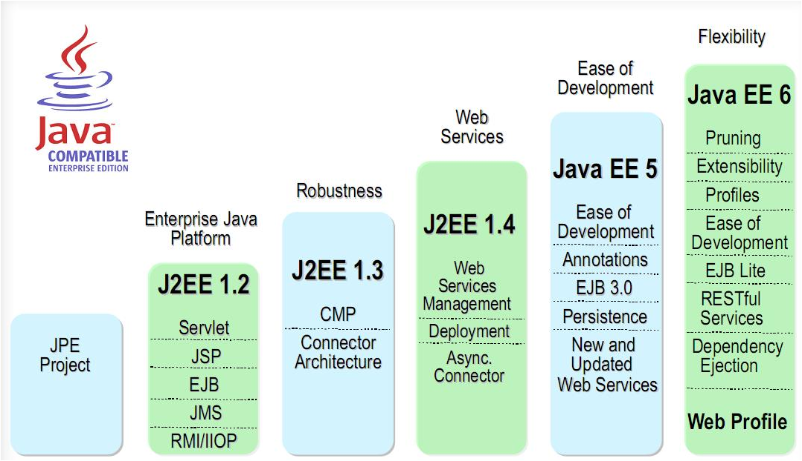
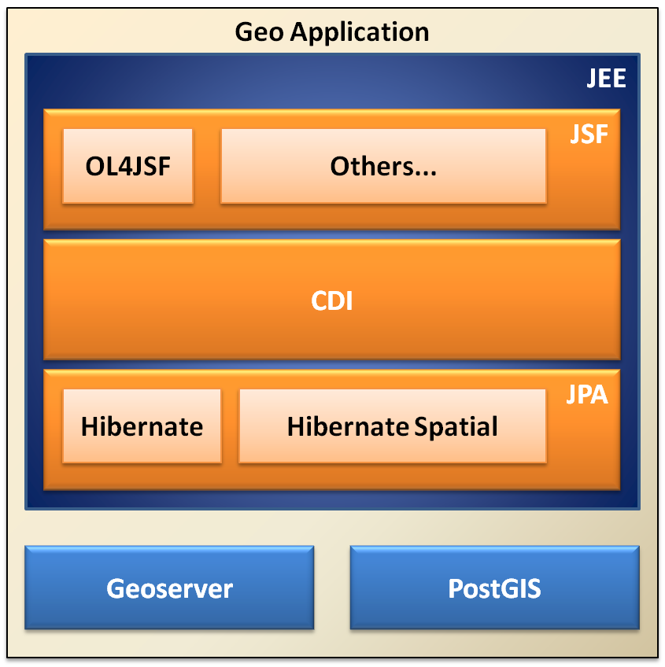

:Author: Rafael Soto
:Author: Robert Anderson
:Version: |release|
:License: Create Commons with attribution

**************************************************
Desenhando a Arquitetura da Aplicação (GEO - JEE6)
**************************************************

.. contents::

Nesse capítulo vamos fazer um breve comentário sobre alguns recursos disponíveis no JEE 6, além de propor uma arquitetura simples, porém funcional, para elaboração de SIGs Web.

#######################
Java Enterprise Edition
#######################

Podemos perceber pela imagem acima que o JEE vem evoluindo consideravelmente desde sua primeira versão em meados de 1999. Dessa forma, a versão JEE 6 carrega consigo muita maturidade, obtida ao longo de todos esses anos.

A cada versão torna-se mais fácil se desenvolver com JEE. As anotações introduzidas no JEE 5, foram o primeiro passo para viabilizar a adoção da tecnologia em massa, pois, até então, desenvolver em JEE era um grande martírio: dezenas de arquivos de configuração, necessidade de criação de várias classes somente para "agradar" a especificação, etc.

.. sidebar:: Introducing the Java EE 6 Platform
	
	Como uma visão completa do JEE foge do escopo do curso, sugerimos a leitura do artigo http://tinyurl.com/255gcaj para ter um overview das principais novidades dessa versão.	

No nosso minicurso, não utilizaremos todos os recursos da nova especificação. Mas não se preocupem, o que veremos aqui será o suficiente para o desenvolvimento de aplicações reais. Além disso, não utilizaremos um servidor JEE completo como o JBoss ou Glassfish, por exemplo, utilizaremos o bom e velho Tomcat, ou seja, é muito fácil arranjar planos de hospedagem a um preço acessível.

##############################
Arquitetura de nossa aplicação
##############################

A figura abaixo demonstra de forma sucinta a arquitetura que elaboramos para nossa aplicação:

