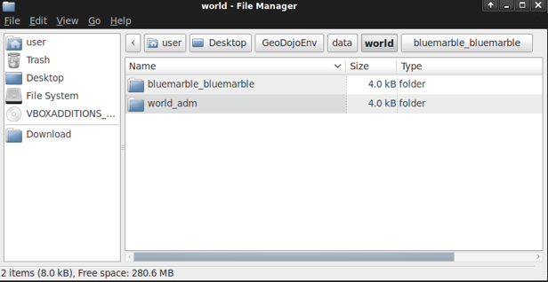

:Author: Rafael Soto
:Author: Robert Anderson
:Version: |release|
:License: Create Commons with attribution

**************************************
  Serviço de Mapas na Web - Geoserver
**************************************
   
.. contents::

Uma das principais componentes de um solução webgis é o servidor de mapas. O servidor de mapas é o responsavel por processar todas as fontes de dados presentes em diferentes tipos de bases, sejam elas arquivo, banco de dados, serviços na web e outros. Os dados processados são organizados na estrutura de layers e estas estarão disponiveis na web, através do protocolo HTTP, para serem consumidas no formato de imagem ou textual(vetores).

A OGC(Open Geospatial Consortium - http://www.ogc.org) regulamenta diversos padrões e formatos com especificações abertos para serem utilizados omo base nos OGC WebServices. Dentre estes serviços podemos destacar o WMS(Web Map Service), WFS(Web Feature Service) e o WCS(Web Coverage Services) que iremos trabalhar durante este modulo do roteiro.

No mundo opensource existem diversos servidores de mapas disponíveis onde podemos destacar o mapserver(http://umnmapserver.org) e geoserver(http://geoserver.org), ambos mantidos pela OSGEO(http://osgeo.org). O mapserver é considerado um dos mais antigos servidores de mapas opensource, escrito em *c/c++* e amplamente utilizado. Não iremos abordar o mapserver neste roteiro.

<< PEGAR DESCRIÇÃO DO GEOSERVER >>

##########################
Inicializando o Geoserver
##########################

Para poupar tempo, estamos utilizando o geoserver instalado na distribuição *LIVE DVD OSGEO*. Não iremos precisar seguir nenhum passo de instalação, apenas configurar o que for necessário para o nosso trabalho. Vamos inicializar o geoserver e fazer as primeiras demonstrações.

1. Acessar a opção no menu *Geospatial >> Web Services >> Start Geoserver*

.. image:: images/menu_start_geoserver.png

2. Se tudo correr bem uma tela com um OK deve surgir

.. image:: images/finish_init.png

3. O geoserver disponibiliza toda a sua interface de administração em formato web. Para iniciarmos as nossas configurações vamos efetuar o login como administrador do geoserver. 

	* Usuario: admin
	* Senha: geoserver
	
4. Na proxima sessão vamos iniciar configurando as nossas camadas.

##########################
Configurando Camada Mundo
##########################

Vamos criar nesta sessão a nossa camadas que será utilizada como base de fundo para os nossos mapas. 

1. A nossa camada mundo é composta de um arquivo raster com uma imagem de satelite no formato tiff e um arquivo shapefile com os poligonos de tdoso os paises do planeta. Vamos abrir a pasta *~/Desktop/GeoDojoEnv/data/world*

2. Agora vamos copiar a pasta world para a pasta *~/Desktop/GeoDojoEnv/geoserver_data_dir/data/*

.. image:: images/copy_world.png

3. Vamos criar um namespace *geodojo* para o nosso roteiro para que tudo fique centralizado nele.

4. Vamos criar um novo *datastore* para adicionar os arquivos que irão compor a camada mundo.

	4.1. Primeiro vamos criar um datastore para o arquivo shapefile
	
	.. image:: images/new_data_store1.png

	.. image:: images/new_vector_datastore1.png
	
	
	.. image:: images/new_vector_datastore2.png

	4.2. Vamos criar um outro datastore para o arquivo raster
	
	.. image:: images/new_data_store2.png
	
	
	.. image:: images/new_raster_datastore1.png
	
	
	.. image:: images/new_raster_datastore2.png

	4.3. Vamos adicionar uma nova *layer* com os dados do nosso shapefile datastore que acabamos de configurar
	
	.. image:: images/add_new_layer.png
	
	.. image:: images/add_new_layer2.png
	
	.. image:: images/add_new_layer.png

	

